# Posterrama Architecture Diagrams

**Version**: 3.0.0
**Last Updated**: 2026-03-25
**Server Size**: 7,666 lines (Refactored from ~20k lines)

---

## Overview

This document provides visual representations of Posterrama's modular architecture, request flows, and system interactions. All diagrams use Mermaid format for inline rendering in GitHub and VS Code.

---

## ️ High-Level System Architecture

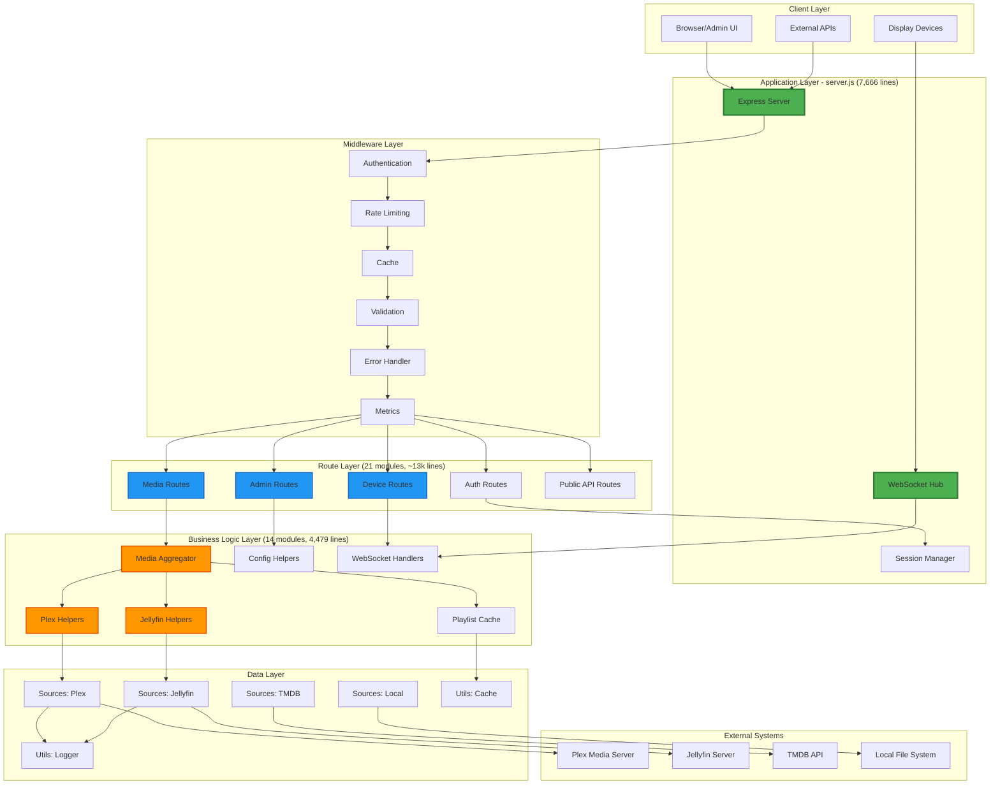

---

## Request Flow: Media Aggregation

Shows the complete flow from client request to media delivery:

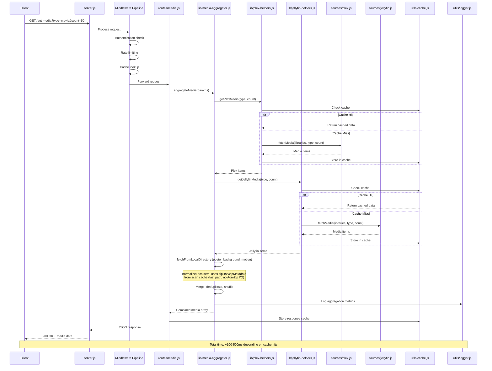

---

## WebSocket Architecture

Device communication and real-time control:

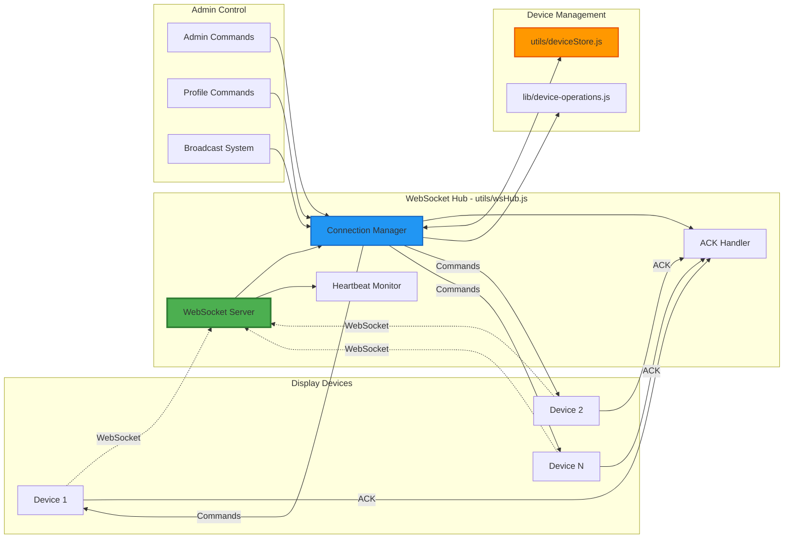

### WebSocket Message Flow

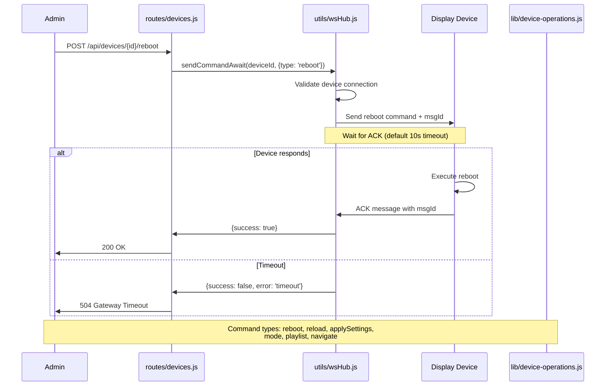

---

## Module Organization

Layered view of the codebase structure:

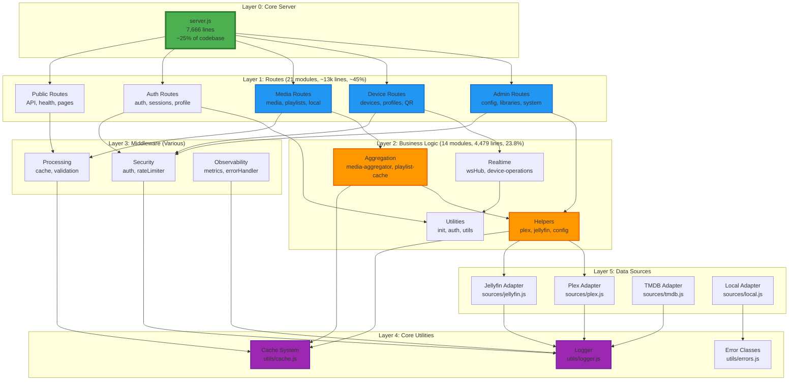

---

## Authentication & Authorization Flow

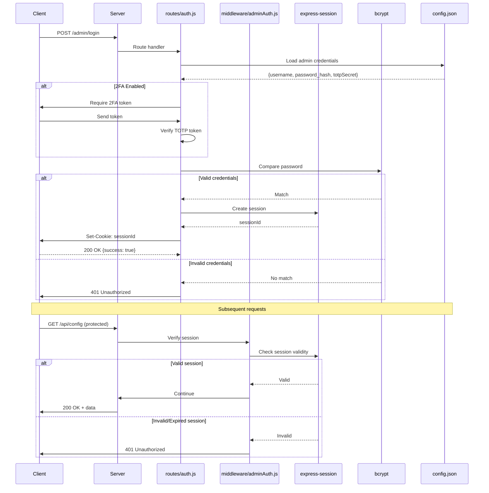

---

## Caching Architecture

Multi-tier caching strategy for optimal performance:

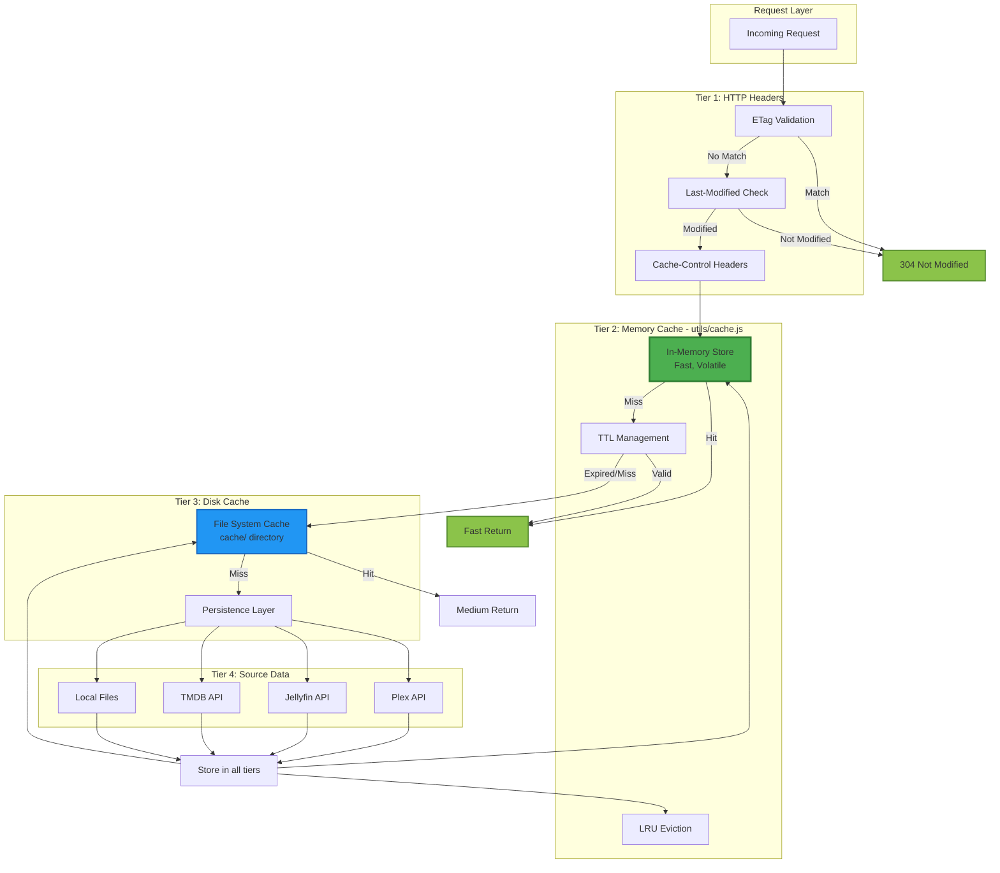

### Cache TTL Strategy

| Data Type        | Memory TTL | Disk TTL   | Reasoning                 |
| ---------------- | ---------- | ---------- | ------------------------- |
| Media Posters    | 1 hour     | 7 days     | Images rarely change      |
| Library Metadata | 5 minutes  | 1 hour     | Frequent updates possible |
| Playlist Data    | 2 minutes  | 15 minutes | Dynamic content           |
| Device Settings  | 1 minute   | N/A        | Real-time updates needed  |
| Config Data      | 30 seconds | N/A        | Admin changes immediate   |

---

## Device Lifecycle

State management for display devices:

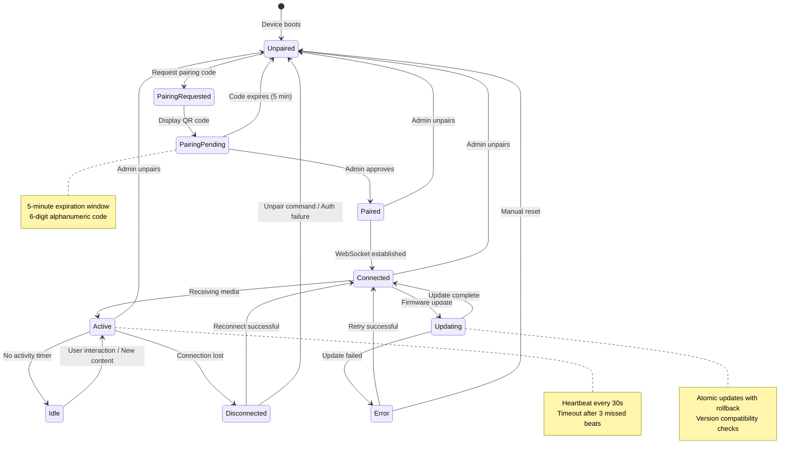

---

## Metrics & Observability

Data flow for monitoring and metrics:

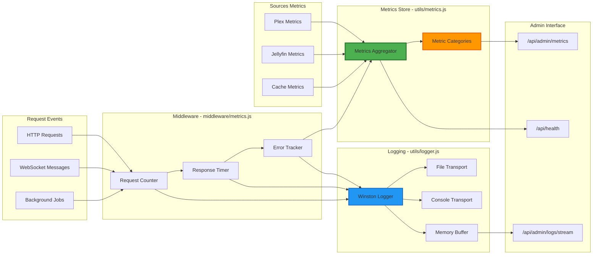

---

## Deployment Architecture

Production environment setup:

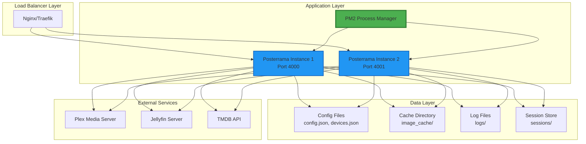

---

## Development vs Production

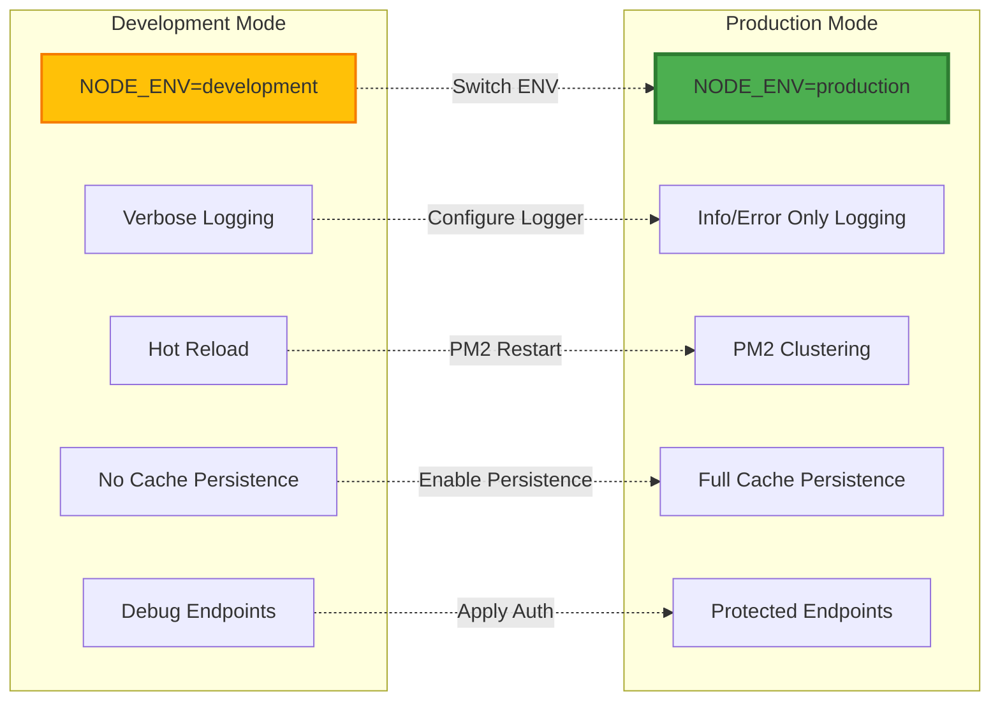

---

## Startup Flow: ZIP Quick-Start

Shows the two-phase startup that avoids opening 1100+ ZIP files on SD card:

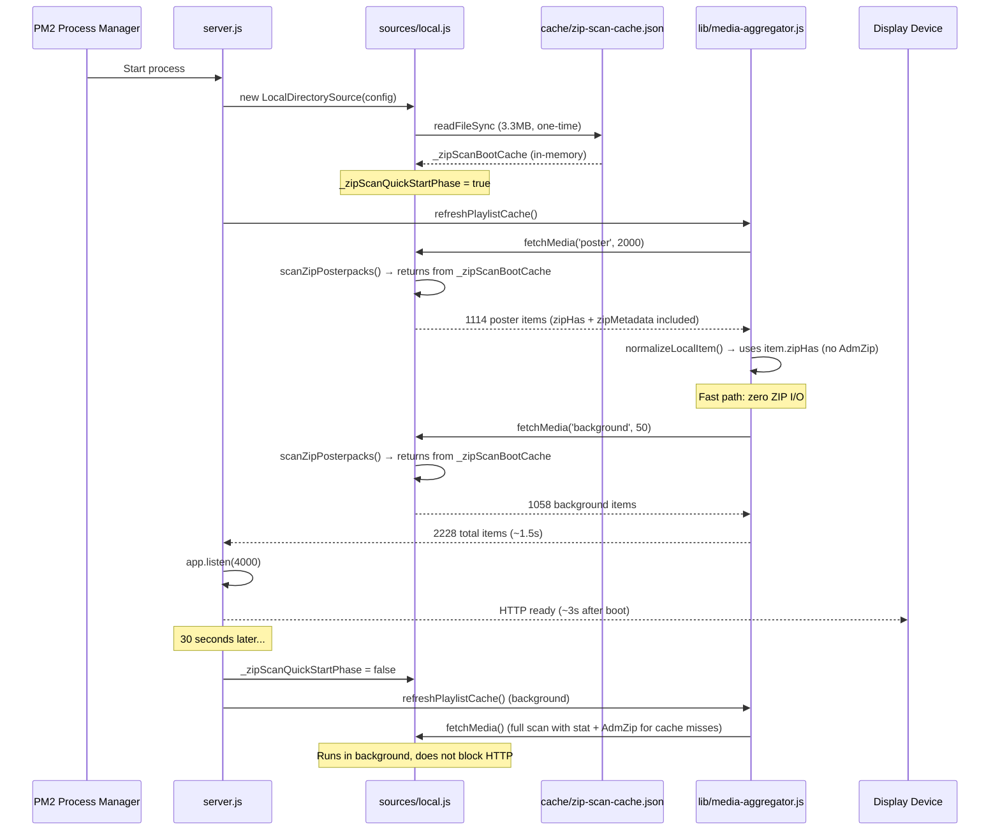

---

## Ongoing Refactors (Tracked Here)

- **Shrink `server.js`:** continue moving route wiring and special-cases into route factories (`routes/`) and services (`services/`) to reduce regression risk.
- **Cache modularity (`utils/cache.js`):** split by concern first, then add JSDoc typedefs incrementally; keep changes small and test-backed.

---

## Related Documentation

- [DEPENDENCY-GRAPH.md](./DEPENDENCY-GRAPH.md) - Module dependency mapping
- [DEPLOYMENT-GUIDE.md](./DEPLOYMENT-GUIDE.md) - Production deployment guide
- [API-PRODUCTION-READINESS.md](./API-PRODUCTION-READINESS.md) - Production readiness checklist
- [OPENAPI-WORKFLOW.md](./OPENAPI-WORKFLOW.md) - OpenAPI export/sync/validation
- [TESTING.md](./TESTING.md) - Test commands and release readiness

---

## Diagram Maintenance

**Update these diagrams when**:

- Adding new routes or modules
- Changing request flow patterns
- Modifying WebSocket behavior
- Updating caching strategy
- Adding new data sources
- Changing authentication flow
- Altering deployment architecture

**Tools for editing**:

- [Mermaid Live Editor](https://mermaid.live/) - Online diagram editor
- VS Code Extension: `bierner.markdown-mermaid` - Preview in editor
- GitHub - Native Mermaid rendering in markdown

---

**Document Version**: 1.0.0
**Last Review**: 2026-03-25
**Next Review**: When changing major architecture
